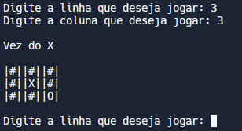

# jogo-da-velha-C
Jogo da velha em C, feito puramente por aprendizado.

### Como Jogar o Jogo

### Como Jogar o Jogo

1.  **Inicie o jogo**: O jogo começa com um tabuleiro vazio representado por uma matriz 3x3 com células contendo `"#"`, representando células vazias.
    
2.  **Alternar entre os jogadores**: O jogo alterna entre os jogadores `X` e `O`. Cada jogador faz uma jogada por vez.
    
3.  **Escolher uma posição**: Cada jogador escolhe uma linha (`x`) e uma coluna (`y`) para fazer sua jogada. As coordenadas `x` e `y` devem estar entre `1` e `3`.
    
4.  **Verificar a jogada**: O jogo verifica se a célula escolhida está vazia (`"#"`). Se estiver vazia, a jogada é realizada e a célula é preenchida com o símbolo do jogador (`X` ou `O`).
    
5.  **Célula já ocupada**: Se a célula já estiver ocupada por `X` ou `O`, o jogador recebe uma mensagem de aviso e deve escolher outra posição.
    
6.  **Verificar a vitória**: Após cada jogada, o jogo verifica se um jogador venceu. Um jogador vence se conseguir alinhar três símbolos (`X` ou `O`) em uma linha, coluna ou diagonal.
    
7.  **Mudar de jogador**: Se ninguém venceu, o jogo alterna para o outro jogador e o processo é repetido.
    
8.  **Terminar o jogo**: O jogo termina quando um jogador vence ou quando todas as células estão preenchidas sem um vencedor (empate).
